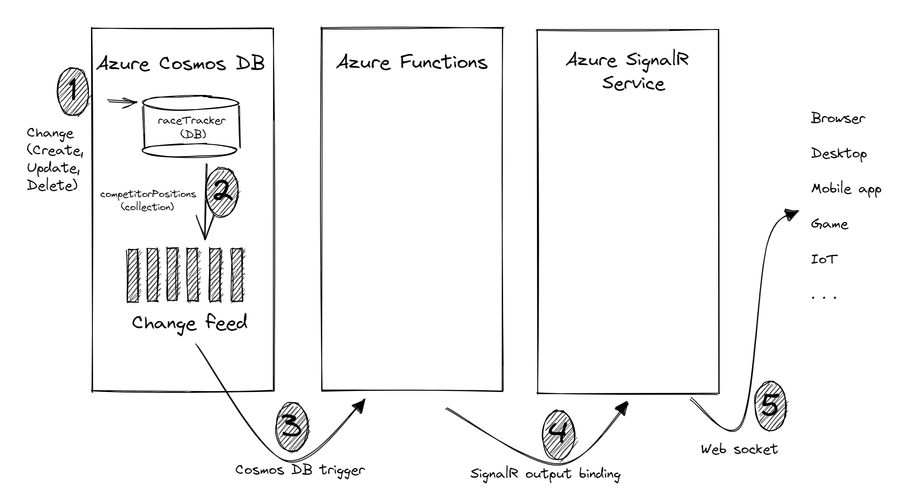

# RaceTracker
Real-time serverless app that allows live tracking of race competitors splits and positions. 
This project is POC of CosmosDB, SignalR service and Azure function.

Code is mainly used for presenting capabilities of using three mentioned Azure services.

Project is planned to have three layered architecture composing of:
- Azure Cosmos DB
- Azure SignalR Service
- Azure function
- Function triggers and output bindings as connection

